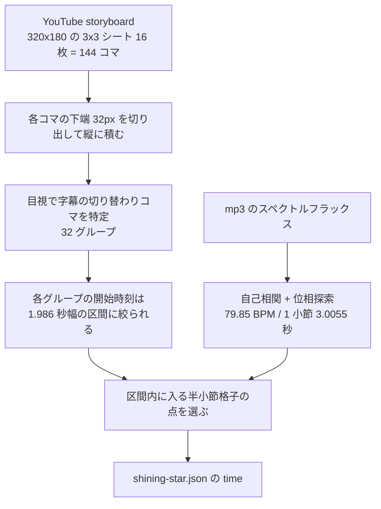

# 素材投入と歌詞タイミングの決定（Issue #8）

音源と本編歌詞をリポジトリに入れ、公開時の既定シートを本編に切り替えた。
一番手間がかかったのは各行の `time` をどう決めるかで、その手順をここに残す。

## 何を入れたか

| ファイル | 中身 |
|---|---|
| `public/audio/maou_14_shining_star.mp3` | 魔王魂「シャイニングスター」5.3MB / 276.56 秒 |
| `public/lyrics/shining-star.json` | 歌詞 51 行 + `time` |
| `src/work.ts` | 作品固有の値（音源パス・既定シート名）を集めた。app 層は曲を知らないままにする |
| `src/lyric-sheets.test.ts` | 公開する JSON 自体を本番と同じ parser で検証 |
| `.github/workflows/deploy.yml` | デプロイ前に `npm test` を通す（壊れた JSON を公開しない） |

## time をどう決めたか

参考にしたのは公式 MV https://youtu.be/Qd01-6xVSHk 。この動画は歌詞が画面下に
焼き込まれた lyric video なので、字幕が切り替わる時刻＝その行の開始時刻になる。

### 使えなかった手

- **字幕トラック**: この動画には字幕も自動字幕も付いていない
- **動画本体のダウンロード**: どの player client でもメディア URL が 403 を返す

### 実際に使った手

storyboard は yt-dlp の `-f sb0` で取れる。動画本体と違って 403 にならない。
mhtml の中に JPEG が並んでいるだけなので、`ffd8ff`〜`ffd9` を切り出せば画像になる。
コマの間隔は mhtml の figcaption に書いてある（17.873 秒 / 9 コマ = 1.98589 秒）。

格子の当てはめは総当たり。小節長 3.000〜3.080 秒、位相 0〜半小節を刻んで、
32 グループ全部が自分の区間に収まる組を探した。結果は 1 小節 3.0055 秒・位相 0.950 秒で、
32 グループすべてが区間内に収まった。

### 動画と mp3 のズレ

動画 282.0 秒に対し mp3 は 276.56 秒で 5.44 秒長い。ただし余っているのは末尾の
クレジットで、先頭は一致している。根拠は歌い出しの時刻:

- mp3: 中央定位成分（`|mid| - |side|` の 300–3000Hz）の比率が 19.8 秒あたりで
  0.27 → 0.45 に跳ね上がる = ボーカルが入る
- 動画: 17.87 秒のコマには字幕が無く、19.86 秒のコマには出ている

どちらも 19 秒台なので、オフセット補正は入れていない。

### 2 行組の分け方

MV は 2 行を 1 枚の字幕にまとめて出す（例: 「ただ風に揺られて 何も考えずに」）。
JSON は 1 行ずつ持つので、2 行目は組の中央を拍（0.751 秒）に丸めた位置に置いた。

## 精度と限界

- **±0.5 秒程度**。storyboard の解像度が約 2 秒しかなく、格子で絞り込んでもこれが下限
- 中央定位からボーカルを取り出す指標は、イントロや間奏では楽器も拾ってしまい当てにならない。
  歌い出しのような「無 → 有」の境目でしか信用していない
- サビ 1 とサビ 4 は同じ歌詞だが、MV 上の字幕の長さが違う（サビ 4 の
  「夢に眠る幻が掌に降り注ぐ」が 1 コマぶん長い）。実際に伸びているものとしてそのまま入れた
- M6 のタイミング入力ツールができたら、この値を出発点に耳で詰め直すのが本筋

## 気をつけたこと

- `public/` に置いたものは全て GitHub Pages に公開される。歌詞の下書き `ss.txt` は
  リポジトリ直下へ移して公開対象から外した
- 歌詞テキストを Web に載せてよいかは魔王魂の利用ルールから読み切れない（明文化されているのは
  主に音源の利用条件）。PLAN.md / README の未確認事項として残っている
