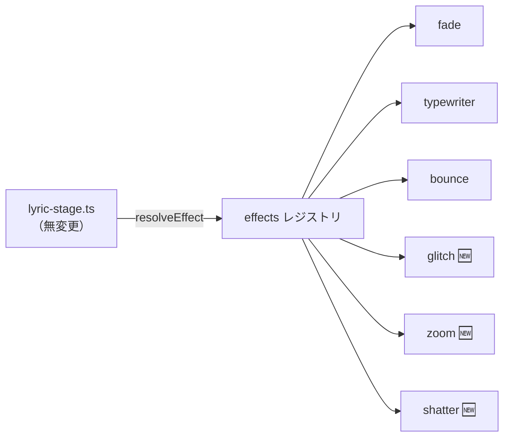

# M4-1: 「刻む」系の演出プリセット（glitch / zoom / shatter）

Issue [#12](https://github.com/bubbleShaker/lyric-stage/issues/12) / PR [#13](https://github.com/bubbleShaker/lyric-stage/pull/13) / コミット `7c624ef`

## 何を足したか

M3 の演出（fade / typewriter / bounce）はどれも「ふわりと出る」系で、参考動画
[字幕演出を刻む【AviUtl】](https://youtu.be/JSFsIsjWINk) の身上である**拍に対して硬く刻む**手触りが無かった。
`src/stage/effects.ts` のレジストリに 3 つ足した。

| 名前 | 仕掛け |
|---|---|
| `glitch` | `steps(4)` の段階的イージングで位置がずれ、RGB がずれた残像（`text-shadow` 2 本）を残して収まる |
| `zoom` | `scale: 3.4` から `expo.out` の急制動で着地する |
| `shatter` | 散らばった破片が `stagger: { from: 'random' }` で順不同に集まって行になる |

**`src/stage/lyric-stage.ts` は 1 行も変えていない。** M3 で引いた「表示側は `switch` せずレジストリを引くだけ」
という形がそのまま効いた。`satisfies Record<string, Effect>` のおかげで `EffectName` / `isEffectName` /
`DEFAULT_EFFECT` も自動で追随する。



## M4 を 3 つに刻んだ理由

PLAN.md の M4 は「グリッチ・ズームイン・縦書き・文字分裂など」だが、**縦書きだけは今の型では書けない**。

```ts
export type Effect = (chars: Element[]) => gsap.core.Timeline;
```

縦書きは文字ではなく行の要素に `writing-mode` を当てる演出だから。今回の 3 つは文字の位置・回転・不透明度
だけで書けるので型はそのままにし、**使う当ての無い引数を先に増やさない**ために型を広げるのは M4-2 に回した。

その代償として `zoom` は行全体ではなく**文字ごとに**拡大する。行全体が迫ってくる本来のズームは
M4-2 で root を受け取れるようになってから別名で足す。

- M4-1（この回）今の型のまま書ける「刻む」系
- M4-2 `Effect` の型を広げ、縦書きを足す
- M4-3 本編シートへの演出割り当て
- M4-4 `prefers-reduced-motion` への対応（レビュー指摘から起こした）

## 詰まった点: gsap は複合文字列の中の「負のゼロ」を読み違える

`glitch` の RGB ずれは `text-shadow` を左右 2 本重ねて振っている。終点をゼロちょうど
（`0em` / `-0em`）にすると、**左右非対称になる**。

実測（gsap 3.15 / Chromium 141）で、`0.06em → 0em` と `-0.06em → -0em` を補間させた中間地点は
`2.1px` / `-0.21px`。本来は `±2.1px` のはずが、負の側だけ桁が変わる。gsap は影のような複合文字列を
「並んだ数値の列」として補間するが、負のゼロの読み取りで躓くらしい。

終点を `-0.001em`（1px の 1/100 未満、見た目はゼロと同じ）にすると対称に戻る。

**ダミーオブジェクト相手では起きず CSSPlugin 経路に固有**なので、`effects.test.ts` では捕まえられない。
再現条件をコード注釈に残した。gsap を上げた時はここを見直す。

## テストの暗黙の前提を剥がした

`effects.test.ts` の「文字数が増えても総時間が伸びない」は、`dummyChars(30)` と `dummyChars(500)` の
総時間が**一致する**ことを見ていた。これは 30 文字時点で文字送りの上限（`MAX_STAGGER_SPAN` = 0.8 秒）に
張り付くことに暗黙に依存している。既存 3 つは 1 文字あたりの希望間隔が広い（0.04〜0.08 秒）ので
たまたま成立していたが、今回のように間隔を詰めた演出を足すと**作りは正しいのに検査だけが落ちる**。

本来の不変条件は「一致すること」ではなく次の 2 つなので、そう書き換えた。

1. 文字が何個あっても、総時間 ≤ トゥイーン単体の長さ + `MAX_STAGGER_SPAN`
2. 文字数を 4 倍（500 → 2000）にしても総時間が変わらない ＝ **本当に頭打ちになっている**

(2) が要るのは、(1) だけだと `staggerFor` を通し忘れた実装が素通りするため。上限を無視した演出を
`each` = 0.05 / 0.01 / 0.003 / 0.0015 / 0.0002 の 5 通り作って変異テストし、全て落ちることを確認した。

基準を `dummyChars(1)` にしているのも意味がある。2 つにすると `staggerFor` が希望の間隔を丸ごと
1 回分返すので、そのぶん (1) の上限が緩む。

## 目視確認のやり方

演出は 1 秒未満で終わるので、普通にスクリーンショットを撮っても何も写らない。
`effect-preview.html` に `window.gsap` を出してあるので、**コマ送り**で見る。

```js
gsap.globalTimeline.pause();
const t0 = gsap.globalTimeline.time();
play('夜を刻む光', 'shatter');
gsap.globalTimeline.time(t0 + 0.15);  // 開始 0.15 秒後の姿
```

dev サーバーの URL は `vite.config.ts` の `base` 込みで `/lyric-stage/effect-preview.html`。

## 飛距離は px でなく文字サイズ基準

`.stage__text` は `font-size: clamp(1.75rem, 7vw, 5rem)` で 28px〜80px まで変わる。当初 `shatter` を
`x: ±180px` で書いたが、320px 幅の端末では画面幅の 56% に達し、下部の `.transport` と重なる時間帯が出た。
`xPercent` / `yPercent`（文字自身の大きさに対する割合）にして解像度非依存にした。

320px / 1280px の両方で `scrollWidth - clientWidth` が 0 であることを実測済み。
`shatter` は行の外へ文字を飛ばすので `body { overflow: hidden }`（`src/style.css`）に依存している。
`html` 側に `overflow` を書くとこの `hidden` は伝播しなくなるので注意。

## レビュー

reviewer サブエージェントに委譲。**🔴 must は無し**。🟡 should / 🟢 nits は全て反映した。

反映しなかったのは `prefers-reduced-motion` のみ。`effects` レジストリを純粋なまま保ったまま
stage 層（`gsap.matchMedia()`）で fade に落とすのが筋なので、M4-4 として別に起こした。
`zoom`・`shatter`・`glitch` は前庭系の症状を誘発しうる部類という指摘。

## 数字

- `npm test` 52 件 / `npm run build`（`tsc` 込み）通過
- 本編の最悪ケース（最短行間隔 2.25 秒 / 最長行 28 文字）に対する各演出の総時間:
  `shatter` 1.50 / `zoom` 1.30 / `glitch` 1.25 / `fade` 1.40 / `bounce` 1.30 / `typewriter` 0.81 秒
