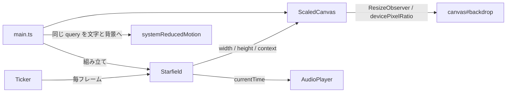

# M5-1: 星空 Canvas の基盤

Issue [#20](https://github.com/bubbleShaker/lyric-stage/issues/20)

## 何をしたか

画面全体に星空の Canvas を敷いた。曲を再生すると星が瞬き、シークすれば瞬きの位相も
一緒に飛ぶ。M5（背景演出）を 2 つに割った前半で、**まだ曲の盛り上がりには反応しない**
（それは M5-2 で、実音を `AnalyserNode` で解析して入れる）。

「星空を描く」と「盛り上がりに反応する」は依存も難易度も別物なので、先に土台だけを入れた。

## 全体の形



| ファイル | 持つもの |
|---|---|
| `stage/starfield.ts` | 星をどう作るか（`createStars` / `starAlpha`）と、いつ描くか |
| `stage/scaled-canvas.ts` | 描画面の辻褄合わせ（大きさ・表示倍率・変換行列） |
| `lib/random.ts` | 種を固定できる擬似乱数（mulberry32） |

## 決めたこと

### 時計は曲の再生位置

`performance.now()` で回すとシークで背景だけ置いていかれる。PLAN の
「演出のマスタークロックは音声の再生位置」に揃えた。停止中は背景も静止する。
rAF は既存の `Ticker` に相乗りしている（ループはアプリ全体で 1 本）。

### 動きを減らす設定では「時刻 0 の星空」に畳む

M4-4 のレビューで出た「背景も動くので `ReducedMotionQuery` を背景側にも渡す」への対応。
`LyricStage` と同じ形（既定値を置かない必須引数）にして、`main.ts` が同じ query を
文字と背景の両方へ配る。

**星は消さない。** `calm` を新設した時と同じ判断で、背景ごと消すと作品が別物になる。
動かない点でも星空は星空。

```ts
const drawTime = this.prefersReducedMotion() ? 0 : time;
```

副産物として、**2 フレーム目以降は前回と入力が同じになり描画そのものが飛ぶ**。
動きを減らしたい人の端末で、同じ絵を 60 回/秒 描き続けずに済む。

CSS 側の `@media (prefers-reduced-motion: reduce)` は足していない（これも M4-4 の
申し送りへの回答）。Canvas の動きは JS 側でこの query を読んで決めるので、
CSS にも持たせると同じ判断が 2 か所に散る。

### 星空は毎回同じ

`Math.random()` を使うとリロードのたびに星空が変わる。配置も作品の一部として固定したいので、
種を決められる擬似乱数（mulberry32）を `lib/random.ts` に置いた。
副産物として、生成結果をテストで検査できる。

星の数は画面の広さに依らず固定で、位置は px でなく 0〜1 の割合で持つ。
リサイズしても空は作り替わらず、同じ空が新しい大きさで描き直されるだけ。

大きさ・明るさ・瞬きの速さは 1 つの `depth`（手前らしさ）から導いている。
それぞれ独立に振ると「大きくて暗い星」のような不自然な組み合わせが混ざる。

## レビューで直したこと

### 装飾の失敗が本編を落としていた（🔴）

`main.ts` はトップレベルの直列実行なので、`Starfield` の組み立てが throw すると
**それ以降（再生コントロールの配線・`ticker.start()`・歌詞の読み込み）が丸ごと止まる**。
歌詞ロード失敗用のフォールバックにも到達しないので、真っ黒な画面に死んだ再生コントロールだけが
残るという、一番原因の分かりにくい壊れ方をする。canvas を塞ぐブラウザは実在する。

背景は装飾でしかないので、組み立てを `try` で囲んで警告に留め、歌詞と音は動くようにした。

### `ResizeObserver` の初回通知は非同期だった

「`observe()` した時点で 1 度鳴るので初期化もそこで済む」と書いていたが、間違い。
実際の初回通知は**購読した次の描画更新のタイミングで、しかも rAF より後**に来る。
つまり最初の 1 フレームは大きさが未定のまま `render` が呼ばれ、既定サイズ（300×150）の
座標系で星が左上に固まって描かれていた（次のフレームで自己修復するので気づきにくい）。

大きさが決まるまで描かないようにした（`surface.ready`）。**テストの偽物が `observe()` で
同期にコールバックを叩いていたため、実ブラウザでは起こり得ない状態を前提にした検査に
なっていた**のがそもそもの原因。偽物は鳴らさず、テストが明示的に通知を起こす形に直した。

### 描画面の責務を分けた

`Starfield` が (1) 星の所有 (2) canvas のライフサイクル (3) いつ描くかの判断 (4) 描画、を
1 クラスで持っていた。このうち (2) は星と関係のない汎用処理なので `ScaledCanvas` に出した。
M5-2 でこのクラスはさらに太るので、分けるなら今が安い。

表示倍率の読み方も `PixelRatioQuery` として注入する形にした（`ReducedMotionQuery` と同じ考え方）。
おかげで `Starfield` の検査はグローバルの差し替えが要らなくなった。

### 描き直しの判定キー

`lastDrawnTime`（時刻だけ）で重複描画を省いていたが、キャッシュのキーは**描画の入力すべて**で
あるべき。描画面の版（リサイズのたびに増える）を足した。M5-2 で盛り上がりの強さが入力に
加わったら、ここにも足す必要がある（足し忘れると、時刻が同じフレームで強さの変化が黙って
捨てられる）。

## 撤回した判断

Issue #20 には「盛り上がりの口（`IntensitySource`）は最初から引数に置く」と書いたが、
実装時に撤回した。M4-1 で決めた**「使う当てのない引数を先に増やさない」**と揃える。
常に 0 を返す実装を配線しても、検査できることは 1 つも増えない。

## 分かっている限界

- 端数のある表示倍率（Windows の 125% / 150% 表示）では、実ピクセルの境界と厳密には揃わない。
  合わせるには `observe` の box に `device-pixel-content-box` を指定する必要があるが、
  対応していないブラウザがあり、星のような点では目視で差が出ないので見送った
- 星の描画は 320 個 × (塗り色の代入 + `arc` + `fill`) を毎フレーム。実機で重ければ、
  表示倍率を 2 で頭打ちにするのが一番効く（星は点なので 3 倍解像度の見返りがほぼ無い）

## 次

M5-2。`<audio>` に `AnalyserNode` を繋いで低音域のエネルギーを 0〜1 に均し、
星の明るさ・大きさに反映する。`AudioContext` の resume はユーザー操作から呼ぶ必要があり、
`createMediaElementSource` に繋いだ後は `destination` へ繋ぎ直さないと音が出なくなる点に注意。
