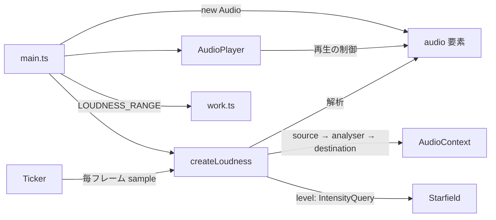

# M5-2: 背景が曲の盛り上がりに反応する

Issue [#22](https://github.com/bubbleShaker/lyric-stage/issues/22)

## 何をしたか

M5-1 で敷いた星空が、曲の盛り上がりに反応するようになった。`<audio>` に `AnalyserNode` を挿し、
低音域（キックとベース）のエネルギーを 0〜1 に均して、星の明るさと半径に反映する。

これで **M5 が完了**（M5-1・M5-2）。

## 全体の形



## 盛り上がりの取り方

3 案から実音の解析を選んだ。

| 案 | 採否 |
|---|---|
| **実音を `AnalyserNode` で解析** | 採用。狙いにまっすぐで、歌詞シートの形を変えずに済み、歌詞の無い間奏でも背景が動く |
| 歌詞シートの行の密度から出す | 不採用。決定的でテストは楽だが、間奏で必ず 0 になり実際の音量ともズレる |
| シートに曲の区間（A メロ / サビ）を書く | 不採用。M2 で確定したデータ構造の変更になり、M6 のタイミング入力ツールにも波及する |

**見るのは低音域（〜200Hz）だけ。** 全帯域の音量だと歌とシンバルで常時飽和して、盛り上がりの
差が出ない。何 Hz までを見るかは `sampleRate / fftSize` からビン本数に逆算している
（本数で書くと、解析の細かさを変えた時に見る帯域が変わってしまう）。

## 窓は実測で決めた

低音域の平均は、この曲では次のように分布していた（開発時に `window.loudness` を毎フレーム読んだ）。

| 区間 | 生の値（中央値） |
|---|---|
| イントロ | 0.73 |
| A メロ・B メロ・サビ | 0.91 |
| ラスサビ | 0.95 |

市販曲のマスタリングでは普通のことだが、**0〜1 をそのまま使うと常に振り切る**。
そこで中央値のあたり（0.85）を 0 に置き、0.98 で振り切る窓に伸ばした。結果:

- イントロは暗いまま（強さ 0）
- A メロ〜サビは中央 0.6 前後で、拍ごとのキックで 0.1〜0.9 に脈打つ
- ラスサビが中央 0.86 で一番明るい

**この幅は曲固有の値**なので、音源のパスや既定シート名と同じ `src/work.ts` に置いた（レビュー指摘）。
曲を差し替える人が `work.ts` だけ見れば済むようにするため。テストの側は幅そのものではなく
「単調に増える・0〜1 にクランプされる」という曲に依らない性質だけを検査している。

## Web Audio の罠

### 繋ぎ忘れると音が消える

`createMediaElementSource(el)` を呼んだ時点で、音の出口が `<audio>` から AudioContext 側へ移る。
`destination` まで繋がないと**無音になる**。しかも解析は動くので背景は正しく反応し、
画面を見ている限り何も間違っていないように見える。

耳でも目でも気づけないので、`AudioContextFactory` を注入する形にして**配線そのものをテストで守る**ことにした。

```ts
expect(audio.source.connectedTo).toEqual([audio.analyser]);
expect(audio.analyser.connectedTo).toEqual([audio.destination]);
```

レビュー指摘を受けて、**投げうる操作（`createAnalyser` / `fftSize` の代入）は付け替えより前**に
移した。付け替えの後で失敗すると「音だけ消えて復旧できない」状態になるため、
順序でもこの不変条件を守る形にしている。

### AudioContext はユーザー操作からしか起こせない

音の自動再生と同じ制限で、`suspended` 状態で作られる。再生ボタンのクリックに相乗りして
`start()` を呼ぶ。2 回目以降は `resume()` だけ。

**一度失敗したら諦める**（レビュー指摘）。ガードが「context が作れたか」だけだと、
途中で失敗する環境ではクリックのたびに AudioContext が増え、
Chrome はページあたり数個で `new AudioContext()` 自体が投げるようになる。

## 要素は composition root が持つ

`<audio>` は `AudioPlayer` の中で `new Audio()` していたので、解析器から触れなかった。3 案:

1. `AudioPlayer` に解析も持たせる → 「音を鳴らす」以上のことを知り始める（SRP）
2. 要素を晒す getter を足す → 何でもできてしまう
3. **要素を composition root が持ち、両者が別々の側面から使う** ← 採用

`AudioPlayer` のコンストラクタが `(media, src)` になった以外の変更は無い。

## 無音では厳密に 0 まで落とす（レビュー指摘）

指数の減衰は 0 に漸近するだけなので、そのままだと停止中も「前回と違う強さ」が何分も続く。
M5-1 で入れた「入力が同じなら描かない」が効かなくなり、**止まった絵を毎フレーム描き直し続ける**。
`smoothLevel` が 0.001 を下回ったら 0 に落とすようにした。

実ブラウザで確認済み: 停止すると強さが厳密に 0 になり、canvas の中身が更新されなくなる。

## 動きを減らす設定

**強さも 0 に畳む。** 音での明滅も「動き」なので、時刻と同じ扱いにする。
畳むことで M5-1 の「2 フレーム目以降は描画そのものが飛ぶ」もそのまま効く。
実測では、解析自体は動いていて強さ 0.93 が返る状態でも、背景は静止したままだった。

## 確認したこと

- `npm test` 122 件通過、`npm run build` 通過
- 実ブラウザ（Chromium）で、イントロと ラスサビの光量が 584 → 1737 と 3 倍になること
- 停止すると強さが 0 になり描き直しが止まること、再開すると戻ること
- `prefers-reduced-motion: reduce` では音に反応しないこと
- **音が消えていないことは耳で確認していない**（headless では聴けない）。配線はテストで守っているが、
  実機で一度聴いてほしい

## 次

M6（タイミング入力ツール）。再生しながらキーを叩くと行の `time` が記録され、JSON として
書き出せるようにする。今の `time` は公式 MV の storyboard から起こした ±0.5 秒程度の値なので、
これで詰め直す。
