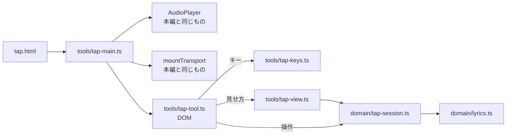

# M6-1 / M6-2a: タイミング入力ツール

Issue [#24](https://github.com/bubbleShaker/lyric-stage/issues/24) / [#26](https://github.com/bubbleShaker/lyric-stage/issues/26)

## 何をしたか

曲を再生しながらキーを叩いて、歌詞の `time` と `duration` を実測で録る道具を作った。

本編シートの `time` は公式 MV の storyboard（約 2 秒刻みのサムネイル）から起こした推定値で、
精度は ±0.5 秒程度。これを耳で詰め直すための道具で、**作品そのものではなく作品を作る道具**。

- **M6-1** `src/domain/tap-session.ts` — 記録のロジック（DOM も音も知らない）
- **M6-2a** `tap.html` + `src/tools/` — 実際に叩ける画面
- 残り: M6-2b（収録途中の下書きの保存と再開）、M6-3（この道具で本編の `time` を置き換える）

## 全体の形



`src/tools/` は「開発用の道具」の層。`app/` `stage/` `domain/` に依存してよいが、**そこから
依存されてはいけない**。Vite のビルド入口は `index.html` だけなので、`tap.html` は `dist` に
入らない（公開サイトには出ない）。

**中身をページに直書きしない**のは `effect-preview.html` の反省。あちらは `tsconfig` の
`include`（`src`）から外れていて、型検査もテストも効かない。

## 収録の形

```
startSession(sheet) → tapIn(t) → tapOut(t) → … → toSheet() → 書き出す JSON
                          ↑ undo / moveCursorTo で録り直す
```

- **既存シートの上書きとして録る。** `text` と `effect` は元シートから持ち出し、`time` と
  `duration` だけを叩いた値で置き換える。M4-3 で決めた演出の割り当てを作り直さずに済む
- **開始が `time`、終了が `duration`。** 終了を叩かなかった行は `duration` を持たず、次の行まで
  表示される。M2 で決めたデータ構造のまま「間」を作れる
- **人間の反応の遅れ（100〜200ms）は補正しない。** オフセット欄を作ると「叩いた値」と「書き出す値」が
  分かれ、どちらを見て詰めているのか分からなくなる

## この差分で一番大事なこと: 壊れたシートを作らない

`LyricSheet` は「`time` の昇順に整列済み」を名乗る型で、表示側（`activeLineIndexAt`）は
二分探索でそれに依存している。収録の途中は**録った時刻と、まだ元のままの推定時刻が混ざる**ので、
何もしないとここが破れる。破れ方が 2 つあった。

| 経路 | 塞ぎ方 |
|---|---|
| 逆行・同時刻の打鍵 | `tapIn` は前に録った時刻より後でなければ記録しない。**比較は丸めた後の値**（書き出されるのはそちら） |
| 録った時刻が、まだ元の時刻のままの後ろの行を追い越す | `orderProblems` が衝突した行を返し、残っている間は `toSheet` が書き出さない |

**並べ替えて直すことはできない。** 歌詞の順は作者が決めたもので、`parseLyricSheet` の整列
（`time` 順）に任せると歌詞の並びそのものが変わる。だから「どの行から録り直せばよいか」を
返して、画面がそれを出す。

## レビューで塞いだ穴

reviewer サブエージェントに 5 巡見てもらい、🔴 must を 4 件直した。いずれも**データを黙って壊す**か
**道具の成果物を壊す**種類で、画面を見ても気づけないものばかりだった。

1. 途中まで録ると、書き出した JSON を読み直したときに**歌詞の並びが変わる**（上の表）
2. 逆行・同時刻の打鍵をそのまま記録していた（同上）
3. `moveCursorTo` で飛んだ先の打鍵が、**以前に録った別の行の `duration` を書き換える**
   → 「直前に叩いた行」を `cursor - 1` で導出せず `pending` として持つ
4. ↑ が `undo` 経由で再発（取り消し先の復元が `cursor - 1` と同じ導出に戻っていた）
   → 収録の区切り `runStart` を持ち、**取り消しは今の収録の始まりより前へ遡らない**
5. （M6-2a）一度書き出した後に録り直しても textarea の JSON が古いまま残り、**見た目は正しい
   JSON なので気づかないまま実測と違う値を貼ってしまう** → 古くなった時点で消す

`3` と `4` は同じ穴が形を変えて 2 回出た。**「直前」をカーソルから導出したこと**が原因で、
状態として持つことでしか塞げなかった。

収録という用途で確実に踏むものも直した:

- `Space` の**長押し（自動リピート）で数十行がまとめて焼かれる**。再生中は `currentTime` が
  進み続けるので、逆行のガードを素通りしていた。`preventDefault` はリピートの判定より**先**に置く
  （後だと押しっぱなしの間だけ既定が生き返り、ページがスクロールする）
- 書き出すと `textarea` に焦点が移り、以降 `Space` も `Backspace` も効かない
  （`readonly` なので画面上は無反応にしか見えず、道具が壊れたようにしか見えない）
- 逆行・録り終わりの打鍵が**完全な無反応**で原因が分からない → 理由を出す
- `Space` を収録に使うため**再生がマウス専用**になっていた → `P` を割り当て

## 設計の当たり

**M6-1 を不変（状態を書き換えず新しい値を返す）にした**投資が、M6-2a でそのまま回収された。

- 無視された打鍵は**同じ参照が返る**ので、画面は `next === session` を見るだけで
  「描き直さない」を決められる
- 取り消しが「1 つ前の値に戻す」ではなく「1 つ前の操作を打ち消す」で書ける

reviewer 側でランダム操作列 3,000 本 × 14 手（約 42,000 操作）のファズも回してもらい、
`runStart <= pending < cursor`・`[runStart, cursor)` に穴が無い・入力を書き換えない・
`toSheet` は正しいシートを返すか例外を投げるかのどちらか、が保たれることを確認している。

## 検査

187 件（`tap-session` 48 / `tap-view` 13 / `tap-keys` 9 を追加）。

実ブラウザ（Playwright、本編 51 行）でも一通り確認した: 録音・取り消し・衝突の検出と解消・
書き出し・長押し 10 連打が 1 行だけ・`P` での再生停止・書き出し後の録り直しで JSON が消える・
書き出し後も収録が続く。

## 使い方

```
npm run dev
→ http://localhost:5173/lyric-stage/tap.html   （?lyrics=sample で別のシートも録れる）
```

`P` か画面下のボタンで再生 → 行の頭で `Space` → 間を空けたい行では `Enter` →
書き出しボタン → `public/lyrics/shining-star.json` に貼る。
