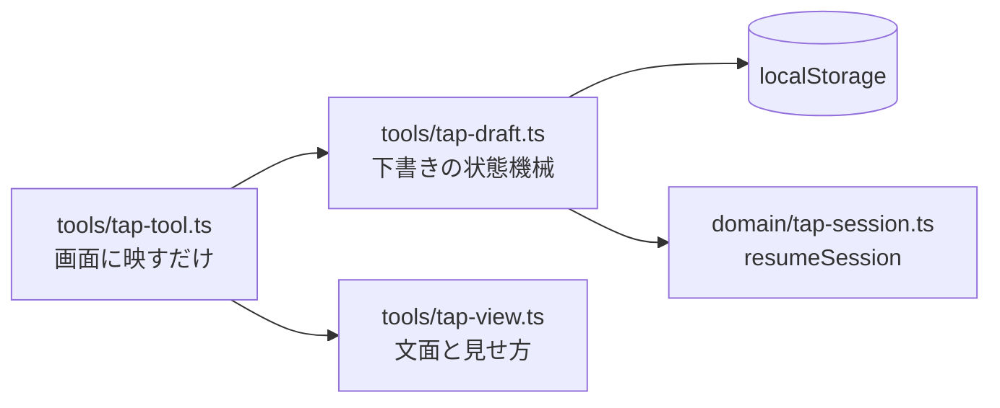

# M6-2b: 収録途中の下書きの保存と再開

Issue [#28](https://github.com/bubbleShaker/lyric-stage/issues/28)

## 何をしたか

収録ページ（`tap.html`）で録った途中の状態が、リロードやタブを閉じたときに消えないようにした。

M6-1 で `toSheet` は「行の時刻が衝突していたら書き出さない」と決めた。これは壊れた歌詞シートを
黙って作るより良いが、そのぶん **リロードすると収録の途中が丸ごと消える** という一点が残る。
`toSheet` に「壊れていても出す」抜け道を作るより、途中の状態を残す方で塞いだ。

## 全体の形

- **`domain/tap-session.ts`** — `resumeSession(source, raw)`。下書きに持たせるのは `takes` だけで、
  `cursor` / `pending` / `runStart` はここで導出する
- **`tools/tap-draft.ts`** — 保存先（`localStorage` を注入）と、下書きの状態遷移
- **`tools/tap-view.ts`** — 知らせの文面
- **`tools/tap-tool.ts`** — 値を要素に映す配線

## 使い方

収録ページは何もしなくても下書きを残す。開き直すと **自動で再開** し、案内に
「下書きから再開しました（N 行）」と出る。最初から録り直したいときは「下書きを破棄」を
2 回押す（1 回目で身構え、2 回目で実行）。

下書きはシートごとに分かれているので、本編と `?lyrics=sample` は混ざらない。

## 設計で効いた判断

### セッションを外から手組みさせない

`TapSession` は `runStart <= pending < cursor` と `[runStart, cursor)` に穴が無いことを守っている。
M6-1 では `pending` を `cursor - 1` で代用していて **二度** 直した経緯があるので、下書きから戻す口も
domain（`resumeSession`）に置いた。UI がオブジェクトリテラルで組み立てられるようにすると、
そこで同じ取り違えが再発する。

再開直後は `runStart = cursor` にした。**取り消しは復元した分へは遡らない**（`moveCursorTo` で
飛んだときと同じ扱い）。`[runStart, cursor)` が空区間になるので、下書きの `takes` が飛び飛びでも
不変条件が自明に保たれるという副産物もついてきた。

### 検証するのは形だけ。時刻の逆行は弾かない

`localStorage` は手で書き換えられる外部入力なので `unknown` から検証して入れる。ただし
**時刻が逆行していても弾かない**。弾くと収録の成果がまるごと失われるが、通せば既存の
`orderProblems` が衝突として拾い、画面から録り直せる。下書きを守る方を優先した。

### 「守られているつもりで守られていない」を作らない

この項目で 🔴 の指摘が **3 回** 出た。いずれも同じ形をしている。

| 回 | 症状 |
|---|---|
| 1 | 読めない下書きを「消さない」と決めたのに、**最初の 1 打鍵の自動保存が上書き**していた |
| 2 | 保存先が使えないとき、何もしない置き場所が**保存できたふり**をして「下書きがある」ことにしていた |
| 3 | 破棄に失敗した瞬間、**「自動保存が止まっている」という重い方の知らせだけが消えて**いた |

対応で決めた形:

- 読めない下書きは消さないうえ、**自動保存も止める**。捨てるかどうかは破棄ボタン（＝人の意思）に委ねる
- 保存先が無いときの置き場所は、保存を求められたら **投げる**（既存の失敗経路に合流させる。
  条件分岐を足すより穴が残りにくい）
- 「直近に何が起きたか」と「今も自動保存が止まっているか」は **別の事実**。文面は両方から組み立てる

3 回とも、判断が画面の組み立てに散っていて検査できない場所から出た。状態遷移を
`tap-draft.ts` の純粋関数（`openDraft` / `keepDraft` / `discardDraft` / `noticeShown`）へ切り出し、
`mountTapTool` は映すだけに戻した。

### 文面ではなく理由を持つ

状態は `'unreadable' | 'save-failed' | 'clear-failed'` のような理由だけを持ち、文面は `tap-view.ts` が
決める。domain の `OrderConflictError` が `problems` を持ち「何行目の何が」を表示側に委ねたのと
同じ分け方。対応表は `never` への代入で網羅を締めてあるので、種類を増やして文面を書き忘れると
コンパイルが止まる（素通しにすると、**警告が空になる**か **新しい知らせが別の文面で嘘をつく**）。

### シートの指紋

保存先をシート名で分けるだけでは、**同じシートの歌詞が書き換えられた場合**を塞げない
（1 行足して 1 行消せば行数も合う）。`title` と各行の `text` から取った短いハッシュ（FNV-1a）を
下書きに持たせ、合わなければ読まない。時刻を録り直しても指紋は変わらない。

## 残したもの

- **Issue [#29](https://github.com/bubbleShaker/lyric-stage/issues/29)** — `mountTapTool` の DOM 配線に
  自動テストが無い。jsdom の導入は本編のテスト環境にも影響するので別の変更として切り出した
- `tap-draft.ts` が「保存先アダプタ」と「状態機械」の 2 役を持っている。次に触るときに割る

## 環境の覚え書き

この WSL の Vite dev サーバーには 2 つの癖があって、目視確認のたびに引っかかった。

- **最初の `fetch` が返らないことがある**（接続待ちで固まる）。別のリクエストを投げると解ける。
  歌詞 JSON の読み込みが終わらず画面が「読み込み中…」で止まるが、アプリ側の不具合ではない
- **`/mnt/c` 配下では変更を拾わない**ことがある。直したはずの文面が古いまま出たら dev サーバーを再起動する

## 次

**M6-3** — この道具で本編シートの `time` を実測に置き換える。M4-3 で暫定 6 秒と置いた最終行の
`duration` もここで詰める。
