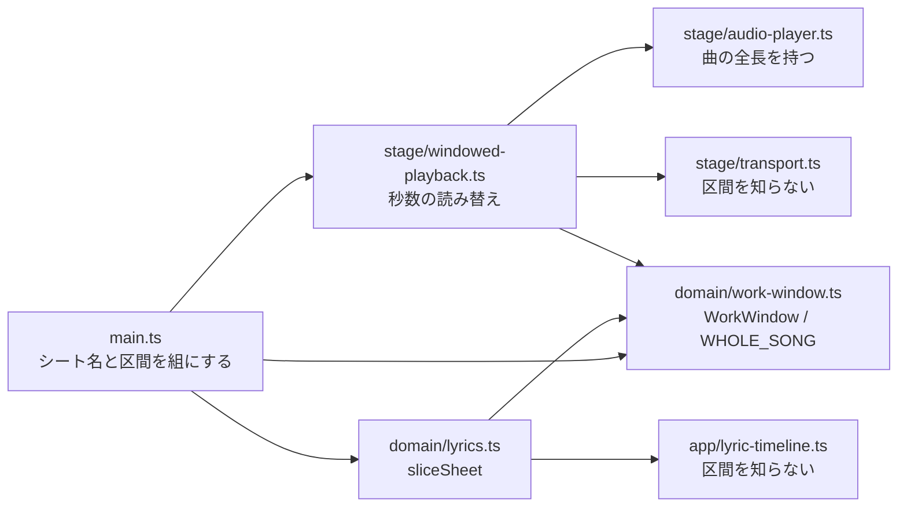

# M8-0: 作品の尺をラスサビ 1 ブロック（約 27 秒）に絞る

Issue [#32](https://github.com/bubbleShaker/lyric-stage/issues/32)

## 何をしたか

演出を**文字PV 風**に作り替える（M8）にあたり、その土台として**作品として見せる区間を
曲の一部に絞った**。

文字PV は 1 行ずつ手で構図を作る作りなので、本編シートの 51 行すべてに構図を用意するのは
現実的でない。曲の中で前後とも切れ目になっている**ラスサビ 1 ブロック**を切り出し、
そこを作り込む。

| 秒 | 内容 |
|---|---|
| 155.7〜179.78 | 24 秒の間奏（前の切れ目） |
| **176.77** | 区間の開始。歌の 1 小節前（79.85 BPM / 1 小節 3.0055 秒）から助走を付ける |
| 179.78〜 | ラスサビ 7 行 |
| **203.82** | 次のサビ頭に折り返す＝後ろの切れ目 |

20 秒に寄せたければ 7 行目を落として `197.81` 止め（21.0 秒）にできる。`work.ts` の定数 1 個。

## 全体の形

- **`domain/work-window.ts`** — `WorkWindow`（区間の型）と `WHOLE_SONG`（曲を丸ごと）
- **`domain/lyrics.ts` の `sliceSheet`** — シートを区間で切り出し、時刻を区間の先頭起点に付け替える純粋関数
- **`stage/windowed-playback.ts`** — `Playback` を実装するデコレータ。`currentTime` / `duration` / `seek` を区間相対に読み替え、終端で止める
- **`main.ts`** — シート名と区間を組にして配る

## 設計で効いた判断

### 「作品は 27 秒のもの」という見方にコード全体を揃える

区間の知識を再生コントロール・停止処理・初期位置に散らすと、同じ判断が 3 か所に増える。
秒数の読み替えを `WindowedPlayback` に、歌詞側の付け替えを `sliceSheet` に集め、
**区間を知っているのはこの 2 つだけ**にした。

結果、`transport.ts` / `lyric-timeline.ts` / `starfield.ts` は 1 行も変わっていない。
どれも「0 秒から始まる作品」を見ているだけで済む。

### 音源は加工しない

魔王魂の利用ルールで加工版の設置は NG なので、mp3 は曲の全長のまま置く。
「27 秒だけ切り出した音源」を作るのではなく、**全長の音源の一部だけを見せる**形にした。

歌詞シートも 51 行のまま残してある。区間を広げ直せるようにするためと、M6-3 の収録が
全曲基準の時刻で行われるため。

### 区間を切らない場合を分岐にせず、`WHOLE_SONG` で表す

区間は**シートに固有の値**なので、`?lyrics=` で別のシートを見るときは当ててはいけない
（当てると開発用の `sample` シートが無関係な区間で切り取られる）。

ここで「区間があるとき／無いとき」で配線を分けると、**区間を使わない経路だけが検査も
されないまま腐る**。`WHOLE_SONG = { start: 0, end: Infinity }` を渡せば `sliceSheet` は
素通し、`WindowedPlayback` は素の `Playback` と同じ振る舞いになるので、組み立て側は
分岐を持たずに済む。素通しであること自体を検査で守っている。

### 終端の見張りは毎フレーム。`timeupdate` は保険

`timeupdate` イベントは 250ms 程度の粗さでしか飛ばないので、それに任せると終端を最大
0.25 秒行き過ぎてから止まり、作品の最後の 1 行が切れて見える。駆動は rAF（`Ticker`）。

ただし `keepInWindow()` は `Playback` port に無いので、`main.ts` の配線を落としても
型検査もテストも通り、**作品だけが終端で止まらなくなる**。被害が「曲の残り全部が流れる」
と大きいので、`timeupdate` 経由でも同じ見張りを掛けて保険にしている。

### 終端で止まった後にもう一度再生できること

これを忘れると「再生 → 即座に見張りが止める」を繰り返し、一度最後まで聴いた人は
リロードするまで二度と再生できない。`toggle()` が終端に居るときだけ頭出しし直す。

## この変更で得たもの

- 文字PV の構図を作り込む対象が **7 行**になった
- **M6-3（タイミング収録）の作業も 7 行で済む**

## 触らなくてよい所（信頼してよい境界）

- `stage/transport.ts` — 「Playback が名乗る長さと位置を映すだけ」に徹しているので、
  区間が入っても変更が要らなかった
- `app/lyric-timeline.ts` / `domain/lyrics.ts` の `activeLineIndexAt` — 切り出した後の
  シートも「time の昇順」を保つので、判定側は何も知らなくてよい
- `src/tools/`（収録ツール）— 区間を適用していない。収録は全曲基準で行う
