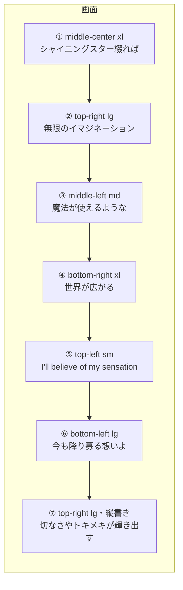

# M8-1: 行ごとの構図をシートに持たせる

[Issue #34](https://github.com/bubbleShaker/lyric-stage/issues/34) / 2026-08-22

「中央に 1 行・1 サイズ」をやめ、**画面の隅・斜め・大小の緩急で 1 行ずつ画を作る**ようにした。
M8（文字PV 化）の本体で、今までとの差が一番大きい部分。

対象は M8-0 で絞ったラスサビの 7 行。

## 何ができるようになったか

歌詞シートに `place` を書くと、その行の置き場所・大きさ・傾きが決まる。

```jsonc
{
  "time": 188.79,
  "text": "世界が広がる",
  "effect": "zoom",
  "place": { "at": "bottom-right", "size": "xl", "tilt": -5 }
}
```

| 項目 | 中身 |
|---|---|
| `at` | 名前付きのアンカー 9 種（`top-left` 〜 `bottom-right`） |
| `size` | 文字の大きさの段階 4 種（`sm` / `md` / `lg` / `xl`） |
| `nudge` | アンカーからのずらし幅。画面に対する割合（`{ x: -0.02 }` など、±0.25 まで） |
| `tilt` | 傾き（度、±30 まで）。時計回りが正 |

7 行の割り当ては次のとおり。隣り合う行が同じ場所に出ないようにしてある。



## 設計

### 構図は `effect` と直交する軸にした

演出名に畳む案（`fade-topleft` など）は取らなかった。7 演出 × 9 配置で組み合わせが爆発するのと、
「同じ `fade` でも右上に置きたい行と中央の行がある」ため。分けたおかげで
**「縦書きで右上に置く」**が自然に書ける（⑦ がそれ）。

### 語彙の持ち主は `effect` と同じ分担

```
public/lyrics/*.json     "at": "top-left"     ← 名前だけを書く
        ↓
domain/lyrics.ts         形だけ見る（空でない文字列か、±0.25 に収まるか）
        ↓
stage/composition.ts     名前 → CSS クラス。知らない名前は既定に落として警告
        ↓
src/style.css            実際の位置・大きさ・傾き
```

domain が CSS の語彙を知らずに済む。綴りの間違いは `src/lyric-sheets.test.ts` が名指しで落とす。

### 構図は「枠」に、演出は「行」に

一番の判断がこれ。`.stage__frame` という**外側の要素**を足し、構図はそちらに当てた。

```html
<div class="stage__frame" id="stage-frame">   <!-- 位置・大きさ・傾き。GSAP は触らない -->
  <div class="stage__text" id="stage-text"></div>  <!-- 文字。SplitText と演出が動かす -->
</div>
```

理由は下の「踏んだ罠」に書いた。

## 踏んだ罠（どれも実際に画面が壊れて気付いた）

### 1. GSAP が `translate` / `rotate` を奪う

GSAP の CSSPlugin は `transform` を自分のものとして扱い、要素に書かれた
`translate` / `rotate` / `scale` を読み取って `transform` に畳み、元のプロパティには
`none` を書き込む。構図を演出と同じ要素に置いたところ、**前の行の寄せ方が次の行に残った**
（左端に置いたはずの行が中央寄せのままだった）。

→ 触る人を要素ごと分けた。中央寄せも `translate` ではなく
**両端を 0 に置いて `margin: auto` に等分させる**書き方にしてある。

### 2. 絶対配置は「残りの幅」に押し込められる

`left: 93%` に置いた行が、**幅 7% の中で 1 文字ずつ縦に折り返した**。
`left` だけを指定した絶対配置の幅は shrink-to-fit で決まり、その上限が「残りの幅」になるため。

→ 枠に `width: max-content` を指定して、内容なりの幅にしてから `max-width` で頭打ちにする。

### 3. 自分の要素への宣言は継承に勝つ

大きさを「基準 × 段階」の掛け算にしたのに、段階が効かなかった。
`.stage__text` 自身に `--size-step: 1` と宣言していたので、枠から継承した値が負けていた。

→ 既定値は `var(--size-step, 1)` と var() の中に書く。

掛け算にしていること自体にも理由がある。段階と基準を両方 `font-size` に直接書くと、
クラスの詳細度が同じせいで後に書いた方だけが効き、**縦書きが構図の段階を黙って潰す**。

### 4. 再生位置が進むのも「操作」に見えてしまう

再生コントロールの自動非表示で、`Playback` の購読をそのまま「起こす」処理に繋いだところ、
**再生中は永久に隠れなかった**。あの購読は `timeupdate`（毎秒 4 回ほど）でも鳴るので、
待ち時間が数え直され続けていた。

→ 止まっているかどうかが**変わった時だけ**起こす。購読自体は外せない
（作品が終端で自動的に止まったときは人が何も触っていないので、無いと隠れたまま戻らない）。

## `.transport` との衝突をどう解いたか

今まで下段は `.stage` の `padding-bottom: 8rem` で一括して避けていた（M4-2）が、
「画面の下端に置く」構図とは正面からぶつかる。

**コントロールの側が退く**ことにした。再生中に操作が 2 秒途切れたら消え、
ポインタを動かすかキーを押すか、停止すると戻る（動画プレイヤーと同じ）。

必ず出す条件を 3 つ置いている。

- **止まっている間** — 止めた人は大抵コントロールを操作したい
- **ポインタが乗っている間** — 触ろうとして近づけた瞬間に逃げると操作できない
- **キーボードのフォーカスがある間** — 隠すと、キーボードだけで操作している人から
  「今どこにフォーカスがあるか」が見えなくなる

隠れている間は `pointer-events: none` も併せる。見えないボタンを押せてしまうと、
歌詞をクリックしたつもりで再生が止まる。

判断は `shouldHideTransport()` という純粋関数に切り出してあり、DOM もタイマーも無しで検査できる。

## 検査

`src/lyric-sheets.test.ts` に 3 つ足した。**全 51 行ではなく、切り出した後の 7 行に課している** —
文字PV は 1 行ずつ手で作るので全行ぶんは現実的でない（M8-0 の決定）。区間を広げたら検査が落ちて、
構図の要る行が増えたことに気付ける。

- 作品に残る全ての行に構図が明示されている（M4-3 で `effect` に課したのと同じ理由）
- 知らないアンカー名や大きさの段階が書かれていない
- 隣り合う行が同じアンカーに置かれていない（狙いは「1 行ずつ違う画になる」こと）

`src/stage/composition.test.ts` と `src/stage/transport-idle.test.ts` を新設。

レビューを受けて、**レジストリのクラス名が `style.css` に実在するか**も検査するようにした。
`resolveComposition` を「名前 → クラス」の唯一の関門にした結果、その先の対応関係だけが
無防備になっていた（`stage__frame--middl` と打ち間違えても全部通り、行が画面の左上に出る）。

このとき `vitest` の既定では **CSS の import が空の stub に差し替わる**ので、`?raw` も
空文字になって検査が常に緑になる。`vite.config.ts` に `test.css: true` が要る。

## 残した宿題

- `mountTransportIdle` の配線（イベント購読・タイマー）が未検査。実測で見つけた本命のバグを
  防いでいるのは、テストの無い `wasPaused` 比較の 3 行だけ
- `LyricStage` に単体テストが無い。管理する状態が 4 つ（split / timeline / layout / composition）に
  増えたので、「付ける側と外す側を同じ所に置く」方針を機械的に守るものが欲しい

どちらも DOM が要るが `jsdom` / `happy-dom` は未導入。入れるかどうかは M8-2 以降の負担と併せて判断する。

## 触ったファイル

| ファイル | 変更 |
|---|---|
| `src/domain/lyrics.ts` | `LyricPlacement` 型と `parseLyricLine` の拡張・範囲の検証 |
| `src/stage/composition.ts` | 新規。アンカー / 大きさのレジストリと CSS クラスへの翻訳 |
| `src/stage/transport-idle.ts` | 新規。再生コントロールの自動非表示 |
| `src/stage/lyric-stage.ts` | 枠と行の 2 要素を受け取り、構図を枠に当てる／外す |
| `src/style.css` | `.stage` を座標系の箱に。`.stage__frame` とアンカー / 大きさのクラス |
| `index.html` / `effect-preview.html` | 枠の要素を追加。プレビューは `play(文字, 演出, 構図)` に |
| `public/lyrics/shining-star.json` | 7 行に `place` を割り当て |

## 次（M8-2）

配色と背景の差し替え（星空 → 文字PV 風）。構図が決まったので背景の密度を決められる。
`Starfield` は消さず「描き手の 1 つ」に格下げし、`ScaledCanvas` / 音量解析 / `ReducedMotionQuery`
の配線（M5 の資産）はそのまま使い回す。
