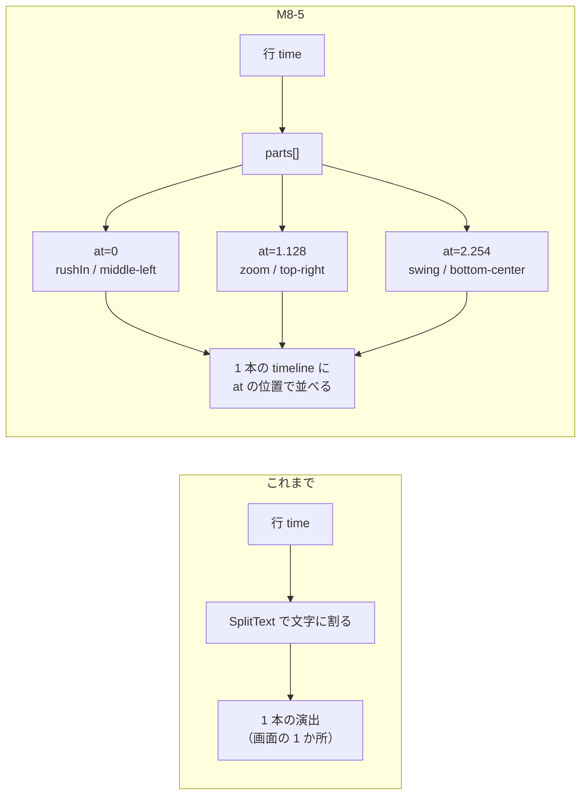

# M8-5 — 行を語句に刻む（parts）と遠近感の演出

2026-08-23 / [Issue #36](https://github.com/bubbleShaker/lyric-stage/issues/36)

## 何をしたか

文字の動きが単調だった。原因は **行が時間の単位だった**こと — `time` が来たら行を丸ごと出し、
SplitText が文字に割って時間差を付けるだけなので、歌詞のどこを歌っているかと画が噛み合わない。

参考にしている文字PV は、語句ごとに別々の時刻で・別々の場所に・奥行きを伴って出る。
そこで **画に出る単位を行から語句へ移した**。



出た語句は**行が終わるまで残る**（積み上げ）。行が変われば枠ごとまとめて消える。

## データの形

```jsonc
{
  "time": 179.78,
  "text": "シャイニングスター綴れば",   // 読み上げ・検査の拠り所として残す
  "effect": "zoomLine",              // 語句が省いた時の戻り先
  "place": { "at": "middle-center", "size": "xl" },
  "parts": [
    { "text": "シャイニング", "at": 0,     "effect": "rushIn", "place": { "at": "middle-left", "size": "lg", "tilt": -3 } },
    { "text": "スター",       "at": 1.128, "effect": "zoom",   "place": { "at": "top-right",   "size": "xl", "tilt": 4 } },
    { "text": "綴れば",       "at": 2.254, "effect": "swing",  "place": { "at": "bottom-center", "size": "lg" } }
  ]
}
```

- `at` は **行の `time` からの相対秒**。M6-3 で `time` を実測に差し替えても刻みが生き残る
- `parts` を省いた行は「`at: 0` の 1 語句だけの行」として同じ経路を通る（`partsOf`）

## 層ごとの担当

| 層 | 何を足したか |
|---|---|
| `domain/lyrics.ts` | `LyricPart` の型と検証、`partsOf`（行 → 語句の列への正規化） |
| `stage/line-timeline.ts` | **新設。** 行を 1 本の timeline に組み立てる。DOM は作らない |
| `stage/lyric-stage.ts` | 語句ごとに枠を立て、行が変わったら枠ごと捨てる |
| `stage/effects.ts` | `rushIn`（奥から迫る）・`swing`（振り向く）を追加 |
| `style.css` | `.stage__lines` に `perspective`、枠と行に `transform-style: preserve-3d` |
| `work.ts` | 尺をいったん 12 秒（3 行）へ |

**毎フレームの配線（`app/lyric-timeline.ts`）は 1 行も変えていない。** domain に聞くのは
今まで通り「今は何行目か」だけ。語句の時間差は行の頭で組む timeline の中にある。

## 時計を音に戻した（レビュー指摘 🔴）

M8-1 までの `LyricStage` は GSAP 自身の時計で演出を流していた。行の中が 1 演出（1 秒未満）
だった頃はズレても見えなかったが、語句の刻み（最大 3 秒）が入ると

- 行の途中で停止を押すと、**音が止まったまま残りの語句が出続けて行が組み上がる**
- 行の途中へシークすると、語句が最大 2.3 秒遅れて出る（出ないまま終わる語句もある）

`LyricPresenter` に `render(offset)` を足し、行の頭からの経過秒を毎フレーム音から渡す形にした。
M2 の技術選定で「マスタークロックは音声の再生位置」と決めていた通りの形に戻したことになる。
時計が 1 本なら、停止もシークも特別扱いが要らない。

開発用の `effect-preview.html` には音が無いので、あちらは自前の rAF が時計になる。
**時計を外から与える形にしたおかげで、音でも rAF でも同じ `LyricStage` が使える。**

## 引っ掛かった所

- **出番の前に語句が見えてしまう問題。** 語句は行の頭でまとめて組み立てるので、`at: 2.254` の
  語句も最初から DOM にある。今ある演出はどれも `opacity: 0` から始まるので実際には見えないが、
  それは**演出の書き方に頼った偶然**。枠に `visibility: hidden` を置き、`at` の位置で GSAP に
  見せさせる形にして、どんな演出を足しても守られるようにした
  - 隠すのは **DOM を作る時**。タイムライン側の `set(..., 0)` に任せると、初回描画が次のフレームまで
    来ないぶん 1 フレームだけ全語句が見えてしまう
- **`z` がただの平行移動になる。** `perspective` は「その要素の子」にしか効かないので、
  間に入る枠と行に `transform-style: preserve-3d` が無いと、親が子の 3D 変形を自分の面へ
  平らに焼き込む。消失点は `.stage__lines` に 1 つだけ張り、散らばった語句で空間を共有させる
- **`filter` は `.from()` で書けない。** 素の見た目が `filter: none` なので `blur(14px)` → `none` は
  補間できない。`.fromTo()` で `blur(0px)` を明示する

## 検査で守っていること

- 語句を繋ぐと行の歌詞に戻る（刻んだ側だけ直して画と歌詞が食い違うのを防ぐ）
- `at` が行の猶予の中にある（一度も出ないまま終わる語句を防ぐ）
- 行の timeline 全体（`at` + 演出）が行の猶予に収まる。**本番と同じ `buildLineTimeline` で測る**
- 作品に出る全ての語句に構図がある／隣り合う語句が同じアンカーに置かれていない
- 作品の行がすべて語句に刻まれている（尺を広げた時に刻み忘れを名指しする）

## 次

`at` の値はモーラ数で按分して拍の格子（79.85 BPM / 1 拍 0.7514 秒）に載せた**目分量**で、
耳で詰めていない。聴いて刻みを詰めてから `WORK_WINDOW` を `203.82`（7 行）へ戻す。
