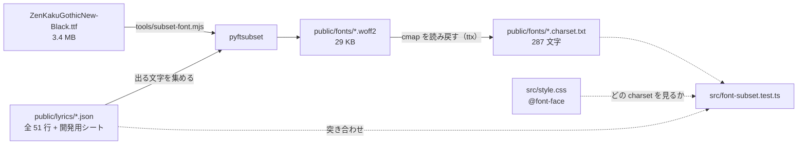

# M8-2a — 書体を選ぶ（Web フォントの導入とサブセット化）

2026-08-23 / [Issue #39](https://github.com/bubbleShaker/lyric-stage/issues/39)

## 何をしたか

M8-5 まで **Web フォントを 1 つも読んでいなかった**。`src/style.css` の

```css
font-family: 'Hiragino Kaku Gothic ProN', 'Yu Gothic', 'Noto Sans JP', system-ui, sans-serif;
```

で OS 標準のゴシック（Windows では游ゴシック）がそのまま出ていた。游ゴシックは本文・UI 用の
書体で、大きく太らせると間延びする。文字PV は書体で見た目の大半が決まるので、
**配色（M8-2）より先にここを決めた** — 配色・図形・字間はどれも書体を前提に決める値で、
先に色を詰めると全部詰め直しになる。

選んだのは **Zen Kaku Gothic New Black**（SIL OFL 1.1）。

## どう選んだか

候補 6 種を**同じ歌詞・同じ組み方**で並べる開発用ページ `font-preview.html` を作り、目で選んだ。
架空の文章ではなく作品に出る語句（`シャイニング` / `無限のイマジネーション` …）をそのまま並べる。
書体の印象は文字の並びで変わるので、見本用の文章で比べると本番でずれる。

| 書体 | 判断 |
|---|---|
| **Zen Kaku Gothic New 900** | **採用。** 今の構図（3D の遠近・傾き・glitch / shatter）に素直に噛み合う |
| Dela Gothic One | 一撃は最も強いが太さが 1 種類。長い行が塊になる |
| Shippori Mincho B1 / Kaisei Decol | 明朝。荒い演出との相性が悪く、演出の割り当てごと見直しになる |
| M PLUS 1 / RocknRoll One | 今の激しい構図に対して当たりが柔らかすぎる |

決め手は「無難だから」ではなく、**太さが 5 段階あること**。M8-2 で語句ごとに太さの差を
付けられる — 単一ウェイトの候補には無い伸びしろ。

## 仕組み



- **CDN ではなく自前でホストする。** 公開ページを外部への接続に依存させないため（音源と同じ扱い）
- **サブセットの文字は `WORK_WINDOW`（今は 3 行）ではなく公開シート全体から採る。** 区間は
  いつでも広げられるべきもので、「今は画に出ないから要らない」にすると
  [#37](https://github.com/bubbleShaker/lyric-stage/issues/37) で 7 行へ広げた瞬間に字が欠ける。
  全 51 行でも 287 文字にしかならない
- **書体は `.stage__text` にだけ当てる。** `:root` に当てると、サブセットに入れていない
  「再生」「読み込み中」のような UI の文字だけが下の候補に落ち、1 つの UI に 2 つの書体が混ざる

## 静かに壊れる所を検査にした

絞った以上、歌詞を書き換えるとサブセットは古びる。しかもこの壊れ方は**目で見ても気付けない**。
ブラウザは字が無いと `.notdef`（豆腐の四角）を描く前に `font-family` の次の候補へ
1 文字ずつ落ちるので、その字だけ別の書体で「それらしく」出る。公開ページだけが崩れて、
テストは全部緑 — 機械に見張らせるしかない。

`src/font-subset.test.ts` が `style.css` の `@font-face` を全部拾い、face ごとに見る:

1. 対応する `*.charset.txt` があるか
2. 公開シートの全文字がその `charset.txt` に入っているか
3. woff2 が `public/fonts/` に実在するか
4. `index.html` で preload されているか

加えて全体として:

5. `@font-face` が 1 件以上あるか（0 件だと上の 4 つが「対象なし」で静かに緑になる）
6. `@font-face` の家族名が `--font-display` の先頭と一致しているか
7. `@font-face` の太さが `.stage__text` の `font-weight` と一致しているか
8. `--font-display` が歌詞以外に広がっていないか
9. `index.html` の `<a href>` が `/` 始まりで public を指していないか

**6 が一番危ない。** 家族名を片方だけ改名しても、woff2 は実在し preload も charset も一致し、
`loadDeclaredFonts` は face を読み込んで待ちすらする（宣言された face を舐めるだけで、
使われるかは見ていない）。全部緑のまま、公開ページだけ游ゴシックで出る。

4 と 9 も**画面を見ても気付けない種類のずれ**。preload がずれても書体は出る（取得が二重になるだけ）。
9 は実際に踏んだ — Vite が base を足すのは link / script / img など「取得のための属性」だけで、
`<a href>` は書き換えないので、dev では通り GitHub Pages でだけ 404 になる。

**検査の起点は `style.css`。** `charset.txt` を名指しで import すると、書体を差し替えたときに
CSS は新しい woff2 を指しているのに検査だけが古い一覧を見たまま緑になる。歌詞シートの一覧も
`import.meta.glob` に寄せて、ツール側（`public/lyrics/*.json` を全部読む）と同じ集合にした。

**`charset.txt` はサブセットの後に、出来上がった woff2 の cmap から読み戻す。**
「入れたかった文字」を先に書くと穴が 2 つ空く — pyftsubset が落ちても `charset.txt` だけが
新しくなって検査が緑になる、そして pyftsubset は元フォントに無い文字を黙って捨てるので
一覧が嘘をつく。読み戻せば「フォントが実際に持っている文字」という不変条件になる。

## 書体の読み終わりを待ってから演出を組み立てる

M8-5 の演出は SplitText が測った**文字ごとの座標**に依存しているので、測った後に書体が
差し替わると字幅が変わって位置がずれる。

**これは `font-display` では解けない。** `block`（読み終わるまで描かない）はちらつきを
隠すだけで、**レイアウトは代替の書体の寸法で確定する**ため、測定はやはり代替の寸法で行われる。
待つ以外に手が無い。

`src/stage/display-font.ts` が `document.fonts` の face をすべて読み終えるまで待ち、
`main.ts` が歌詞シートと合わせてから `mountLyricTimeline` を呼ぶ。

- **家族名も太さも JS に書かない。** `document.fonts` を舐めれば CSS が宣言した face が
  そのまま取れるので、書体を差し替えても太さを足してもここは変わらない
- **決して失敗しない。** 書体は作品の見た目であって本体ではないので、読めなくても歌詞と音は
  動かす（背景の星空を try で囲っているのと同じ判断）。返って来ない場合に備えて 3 秒の上限も置く

待つ側が居るので `font-display` は `swap` にした。woff2 が 404 になったときに
「歌詞が 3 秒消える」（`block` の副作用）のを避けられる。29 KB は `index.html` で preload 済み。

**揃う前でも再生ボタンは押せるままにしてある。** 歌詞の判定は毎フレーム「今は何行目か」を
聞き直す作り（`app/lyric-timeline.ts`）なので、後から刺さった時点の正しい状態がそのまま揃う —
行を取りこぼすのではなく、揃うまで何も出ないだけ。逆に disabled にすると、`transport.ts` が
避けている罠（iOS Safari は `play()` を呼ぶまでメタデータを取りに行かないので、読み込み待ちで
無効化すると永久に再生できない）をこの待ちで作り直すことになる。

## 組み方を詰め直した

書体ごとに字面（em に対する字の大きさ）が違うので、游ゴシック 700 に合わせていた値をそのまま
使うと見え方が揃わない。

| | 前（游ゴシック 700） | 後（Zen Kaku Gothic New 900） |
|---|---|---|
| `font-weight` | 700 | 900 |
| `letter-spacing`（横組み） | 0.08em | 0.02em |
| `line-height` | 1.5 | 1.22 |
| `letter-spacing`（縦組み） | 0.12em | 0.06em |

字間を詰めたのは、極太の書体では文字そのものが塊として効くので、離すと「1 文字ずつ並んだ看板」に
見えるため。縦組みだけ横組みより広げるのは、字面の下の余白が縦では視覚的に効かず、
同じ値だと文字が縦に繋がって見えるから。

## 残したもの

- `font-preview.html` — 開発用（`dist` に入らない）。書体を選び直すときに使う
- `tools/subset-font.mjs` — サブセット化。手順は README の「作者向け: 書体を作り直すとき」。
  元 ttf の取得はコミット SHA 指定 + sha256 の照合にしてある（追跡しているのは加工後の
  woff2 だけなので、出どころは書き残すしかない）
- **選ばれなかった候補の woff2 は追跡しない**（`.gitignore`。音源・歌詞シートと同じ流儀）。
  見比べ直すには作り直しが要る

## 残した宿題

**「何が描かれるか」の定義がツールと domain で二重になっている。** `tools/subset-font.mjs` は
`.mjs` から TS の domain を読めないので、`parseLyricSheet` / `partsOf` を使わずシートの構造を
読み直している。今はツール側が上位集合（行の `text` と語句の `text` の両方を拾う）なので実害は
無く、検査が domain 経由で「歌詞 ⊆ フォント」を見張っているぶん穴も塞がっている。ただし
シートに項目が増えたとき（ルビ、英字サブテキスト）ツールだけが取り残される。

## 次

M8-2（配色と背景の差し替え）。書体が決まったので、色の数と図形の細さをこの書体に合わせて決められる。
