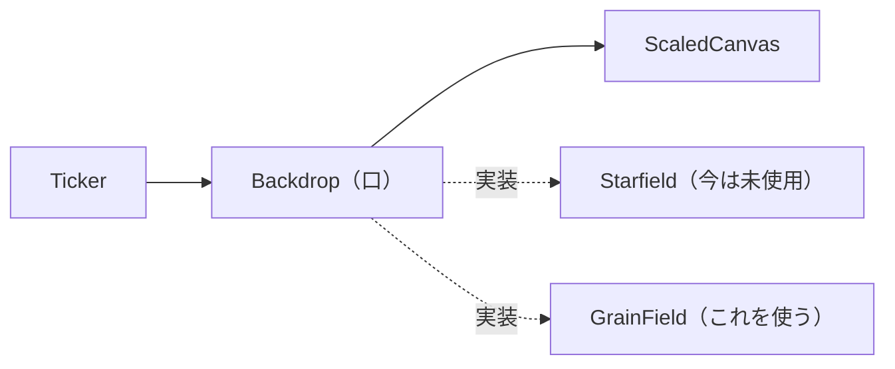

# M8-2 — 配色と背景の差し替え（星空 → 粒と光）

2026-08-24 / [Issue #41](https://github.com/bubbleShaker/lyric-stage/issues/41) / [PR #42](https://github.com/bubbleShaker/lyric-stage/pull/42)

## 何をしたか

背景がまだ **M5 の星空のまま**だった。これは「夜空」であって文字PV のグラフィックではない。
加えて #39 で書体を極太 900 にしたことで噛み合わせが悪くなっていた —
**画面全体に散った 320 個の点と、文字の塊が同じ明度帯で競る**。

背景を文字PV 風のモノトーンに差し替え、あわせて **CSS と TS に割れていた色を 1 か所に集めた**。

## 決めた 4 つの分岐点

この回は「実装より先に決めることが本体」だったので、設計の分岐点を Issue に書き出してから着手した。

| 分岐点 | 決めたこと | 理由 |
|---|---|---|
| `Starfield` の扱い | `Backdrop` の口を切って**差し替え**（消さない） | 層が 2 つある状態では密度を決められない |
| 色の置き場所 | **TS のパレット**を単一の情報源にし、CSS との一致を検査 | `getComputedStyle` は描き手に DOM 依存を持ち込む |
| 配色の粒度 | **全体で 1 パレット**（明度の段を役割名で持つ） | 行ごとの色はシート検査が倍になる |
| 差し色 | **黄 `#ffd60a`**、使うのは「触れる所」だけ | 地に対するコントラストが一番高い |

### 1. なぜ「重ねる」ではなく「差し替え」なのか

PLAN には「`Starfield` を消さずに描き手の 1 つに格下げする」と書いてあった。
文字どおり素直なのは **星空を一番奥に薄く残して新しい層を重ねる**形だが、採らなかった。

M8-2 の目的は「**背景をどれだけ引くか**」を数字で決めること。そこに星空の残りが混ざると、
今見えている絵のどこが効いているのか読めない。口（`Backdrop`）さえ切っておけば、
重ねる判断は後からいつでもできる。

**ただし「口を実装すれば並べられる」わけではない**（レビューで判明）。実装はどれも自分で
`clearRect` を呼ぶので、素直に 2 つ呼ぶと後の層が前を消す。`LayeredBackdrop` を作る時は
「画面を消すのは誰か」を口の側で決め直すことになる。

### 2. 色を TS に集めた理由

M8-2 より前は、**同じ色が 2 か所に書かれていた**。

| 色 | `style.css` | `starfield.ts` |
|---|---|---|
| `#f4f6ff` | `--stage-fg` | `WHITE` |
| `#7fd7ff` | `--stage-accent` | `CYAN` |
| `#05060d` | `--stage-bg` と `.transport__toggle` の `color`（**変数があるのに直書き**） | — |

集約先の候補は 2 つあった。

- **CSS を唯一の源にし、canvas は起動時に `getComputedStyle` で読む** — 本当に 1 か所になるが、
  描き手に DOM 依存が入る。今の `Starfield` は `DrawSurface` という口しか知らずにテストできていて、
  この美点を配色のために手放すのは割に合わない
- **TS にパレットを置き、CSS はそこからの写しにする** ← 採用。写しは残るが、
  一致を**検査で見張る**（#39 の `font-subset.test.ts` と同じ手）

## 新しい背景（`GrainField`）

採ったのは 2 つだけ。

- **中心の光** — 淡い放射のグラデーション。音が大きいほど広がって明るくなる
- **フィルムグレイン** — 細かい粒。12 コマ/秒で**組ごと差し替えて**ちらつかせる

粒を「動かす」のではなく「組ごと差し替える」のは、同じ粒をずらすと**粒が流れる絵**になり、
フィルムグレインではなく降る雪や埃に見えるため。副産物として、描き直しの判定が
「何番の組か」を見る形になった。

**帯・枠・グリッド・英字サブテキストは入れていない。** あれらは図形グラフィックそのもので
M8-3 の担当。ここで先に置くと M8-3 が背景と図形の両方を触ることになり、
どちらの層の話をしているのか分からなくなる。

## 目で見て決めた値

画面を見ないと決められない類のものが 3 つあった。`effect-preview.html` に背景を出せるように
してある（音が無いので強さは `window.loud` で手で動かす）。

- **粒は 2600 個**（最初は 420）。薄いグラデーションは canvas の 8bit 出力では階調が足りず
  **同心円状の縞**（バンディング）が出る。粒を密に撒くと境界がばらけて縞が弱まる —
  つまり**粒がディザとして働く**
- **光の色は `dim` ではなく `mute`。** `dim`（`#16171c`）は地（`#0a0a0c`）との差が小さすぎて、
  不透明度をどう上げても「わずかに明るい黒」にしかならなかった
- **粒の濃さは上限 0.22。** これ以下だと粒があること自体が分からず、大きく上げると
  星空と同じ失敗（点が文字と競る）をやり直す

## 検査で止めていること

このプロジェクトは「**テストは緑のまま公開ページだけ壊れる**」類の事故を検査で止める方針で、
今回もそこに時間を使った。

- `:root` の宣言が `PALETTE` と一致するか（**両方向**）
- **16 進カラーが `:root` の外に書かれていないか** ← これが本題。一致だけを見ても、
  今回見つかった `#05060d` の直書き（変数があるのに使っていない）は捕まらない
- `PALETTE` の値が `#rrggbb` の 6 桁か（`withAlpha` は末尾に 2 桁足すだけなので 6 桁が前提。
  3 桁を足すと `'#fff80'` という 5 文字を返し、canvas はそれを黙って捨てる）
- 粒の色が `mute` か / 光の半径が**短辺**から決まっているか / `glowStops` の**向き**

## つまずいたこと

### 秒の整数はどれも 0 番の組に当たる

`GRAIN_FPS = 12` で組が 4 つなので、**1 秒・2 秒・5 秒・12 秒・30 秒はどれも 0 番**。
`render(1)` と `render(30)` を比べる検査は、`prefers-reduced-motion` の畳み込みが効いていなくても
「変わらなかった」で通ってしまう。3 件が空振りしていた。

時刻を 1.1 秒（1 番）/ 2.2 秒（2 番）/ 12.1 秒（1 番）に選び直し、
畳み込みを外すと 3 件落ちることを確かめた。

### 描き直しの抑えが再生中ほぼ効いていなかった（レビュー 🔴）

「同じコマなら描かない」の判定に、控えとして生の強さを入れていた。
`createLoudness` の `level()` は**毎フレーム平滑化される連続値**なので、音が鳴っている間は
必ず前フレームと違う値になる → 判定が常に false → **12 コマ/秒のつもりが 60 コマ/秒**で
2600 個の粒を塗り直していた。

強さを 32 段に丸め、**控えと描画の両方で同じ値**を使うようにした（片方だけ刻むと、
控えは「同じ」と言っているのに絵が違う状態になる）。段の幅は粒の濃さでも光の半径でも
目に見えないことを画で確かめた。

一般化すると、**「入力が同じなら描かない」は入力に連続値が混じった時点で無効になる**。
M8-4（ビート同期）で新しい入力を足す時も同じ判断が要る。

### 検査が色を見ていなかった（レビュー 🟡）

`FakeContext` が `fillRect` の記録に**色を含めていなかった**ので、粒を `PALETTE.ink`
（文字と同じ白）で塗っても 434 件が全緑だった。M8-2 が潰そうとしている失敗そのものが
素通りする状態。同じく `createRadialGradient` の引数を捨てていたので、
光の半径を長辺から取るように変えても緑だった。

指摘に対応した検査は**すべて壊して落ちることを確かめた**（粒を白く塗る / 光を長辺から取る /
量子化をやめる / 光を逆向きにする / 粒を巨大にする、の 5 通り）。

### コメントに色を書くと検査が落ちる（自分で見つけた）

「16 進カラーは `:root` の外に書かない」の検査が、**コメントの中の色まで拾っていた**。
このリポジトリは「なぜ変えたか」を長文コメントに残す流儀なので、
説明を 1 行足しただけで落ちる。走査の前にコメントを落とすようにした。

なお見ているのは 16 進の書き方だけで、`rgb()` / `hsl()` / `color-mix()` はすり抜ける。
塞ぐには CSS を本当に解析するしかなく手間に見合わないので、
「このファイルの色は 16 進で書く」を約束として明記する側にした。

## 残した宿題

- **バンディングが完全には消えていない。** 潰すならノイズのタイルを焼いて `createPattern` で
  敷く形（本来のフィルムグレイン実装）になるが、オフスクリーンの canvas が要るぶん
  描き手に DOM 依存が入る。文字が乗ればほぼ気にならないので、M8-3 / M8-4 の後の画を見て決める
- **`Starfield` は誰にも使われていない。** `Backdrop` の実装として残してあるが
  「消し忘れ」と見分けが付かない。M8 が終わる時点で `LayeredBackdrop` を作らないなら、
  その時に消すかどうかを決める
- **`dim` はまだ誰も使っていない。** M8-3 の図形グラフィックで使う段として置いてある

## 次

**M8-3**（図形グラフィック — 帯・枠・グリッド・英字サブテキスト）。
今回パレットを揃えて `dim` / `mute` / `accent` の段を用意したので、
図形はその段を組み合わせるだけで済むはず。
