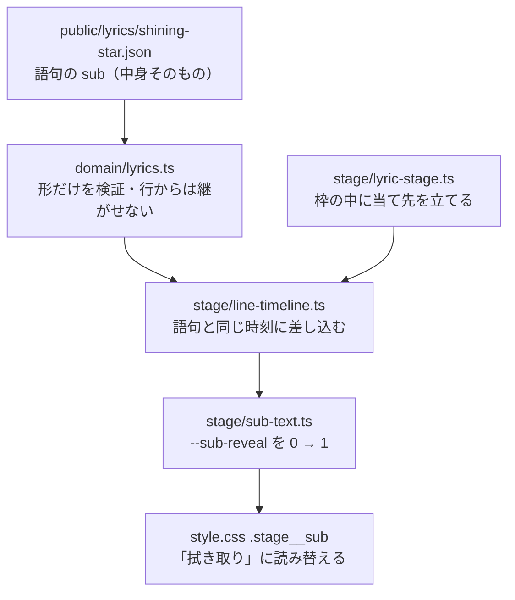

# M8-3c: 語句に添える英字サブテキスト（Issue #47）

文字PV の骨格の最後の一片。語句の上に小さく字間を空けた英字を添える。
帯・罫・枠（M8-3a）と画面の分割線（M8-3b）に続く、M8-3「図形グラフィック」の 3 つ目。

```
  L I K E   M A G I C
   魔法が
```

## 何ができるようになったか

歌詞シートの語句に `sub` を書くと、その語句の上に英字が現れる。

```jsonc
{
  "text": "魔法が",
  "at": 0,
  "effect": "rushIn",
  "place": { "at": "middle-center", "size": "xl", "nudge": { "y": -0.1 }, "tilt": -3 },
  "sub": "LIKE MAGIC"
}
```

作品（ラスサビ 3 行）への割り当ては 1 行に 1 つずつ:

| 行 | 語句 | 英字 |
|---|---|---|
| シャイニングスター綴れば | 綴れば | SPELL IT OUT |
| 無限のイマジネーション | イマジ | INFINITE |
| 魔法が使えるような | 魔法が | LIKE MAGIC |

いずれも図形の無い語句。これで 1 行の 3 語句が「図形 / 図形 / 英字」と違う重みを持つ。

## 作りの地図



図形（`decor`）と兄弟の作りだが、**レジストリを持たない**のが違い。図形は「帯か罫か」を
名前で選ぶのでレジストリが実体を持てるが、英字は語句ごとに違う文字列なので、
中身はシートが持ち、`stage/` 側は見せ方だけを持つ。

## 引っ掛かった所（次に触る人へ）

### 通常フローに入れると、図形が全部ずれる

英字は枠（`.stage__frame`）の中に**絶対配置**で置く。枠は `width/height: max-content` なので、
フローに足すと枠の箱が英字ぶん伸びる。`.stage__decor` の `inset` は枠の箱を基準にしているので、
**帯が語句の上に乗り上げる**。原因は英字の側にあるので、帯を見ている限り気付けない。

### 箱で拭き取ると、はみ出した字が永久に消える（レビュー指摘 🔴）

`clip-path` は**要素の箱**で切る。英字の箱は枠（＝語句）の幅に張ってあるので、そのまま
拭き取ると**語句より長い英字のはみ出した分が一生描かれない**。今のシートは 3 つとも
語句より短いので画には出ていないが、長い英字を書いた瞬間に「なぜか尻が出ない」になる。

しかも **`getBoundingClientRect` はクリップ後の見えを返さない**ので、この milestone で使った
実測の手順では原理的に捕まらない。箱（`.stage__sub`）と字（`.stage__sub__text`）を分け、
拭き取りを字の側に掛けて解いた。副産物として、拭き取りの 0.38 秒が字の上をまるごと進むようになった
（枠幅で切っていた頃は、中央寄せだと字の左右の空きを拭う時間まで含んでいた）。

### 「はみ出しは内側へ逃がす」は誤りだった

Issue #47 にはそう設計を書いたが、実測すると **`text-align: right` でも英字は右（行末の側）へ
あふれる** — 左には回らない。右端に置いた語句では画面の外へ出る。

そこで「英字は語句より短く保つ」を約束にし、字送りから見積もって
**「英字の文字数 ≤ 語句の文字数 × 4」** を検査にした。

最初は × 5 にして「余裕を持って」と書いたが、**5 倍は余裕どころか均衡点そのものだった**
（この書体の大文字の字送りは平均 0.636em なので、英字 1 文字 ≈ 語句の 0.21em に対して
和文 1 文字 1.02em ＝ 4.8 倍で等しくなる）。15 文字の英字が実測 102% の幅で並んでも
通っていたので、4 倍に締め直した。小さな段階や狭い画面では英字の下限（0.62rem）が効いて
「語句の 0.2 倍」の前提が崩れるので、その分の余裕もこの 4 倍に含めてある。

### 大文字化を CSS でやってはいけない

`text-transform: uppercase` を使うと、書体のサブセットが見ている集合（JSON の文字）と
実際に描く字がずれる。小文字だけ書いた JSON から作ったサブセットに大文字が無くても、
**検査は緑のまま公開ページだけが別の書体に落ちる**（M8-2a で「目では気付けない」と
書いた壊れ方の再生産）。大文字で出したければ JSON に大文字で書く。

### 書体を使う要素が 2 つになった

`.stage__sub` にも `font-family` と `font-weight: 900` が要る（書かないと synthetic weight で濁る）。
これに伴い `font-subset.test.ts` を 2 か所書き換えた:

- 「`var(--font-display)` は 1 回だけ」と**数える**のをやめ、**当て先の一覧**で見る形に。
  数えると、作品側に要素を足すたびに検査ごと書き換えることになり、その時に
  「UI へ漏れていないか」を見る目が失われる
- 太さの検査も「歌詞の太さ」から「書体を使う規則すべての太さ」へ広げた

### M8-2a の宿題が予告どおり出た（ただし網は効かない）

`tools/subset-font.mjs` は `.mjs` なので TS の domain（`partsOf`）を読めず、シートの構造を
読み直している。**シートに項目が増えるとツールだけが取り残される**と書いてあったのが、
まさに `sub` で起きた。両方に足して解消したが、二重の定義そのものは残っている。

**「漏れれば `font-subset.test.ts` が落ちる」は `sub` については成り立たない**（レビュー指摘 🟡）。
英字は ASCII に限る約束で、ASCII の可読部はツールの `EXTRA_CHARS` が無条件に入れているため、
拾い忘れても突き合わせは永久に緑になる。今回 woff2 の作り直しが不要だったのと同じ理由。
効かない条件をツール側のコメントに明記した。

## 検査（どれもわざと壊して落ちることを確かめた）

| 検査 | 壊れ方 |
|---|---|
| CSS が `--sub-reveal` を読んでいる | タイムラインは動くのに画は静止 |
| 拭き取りが箱ではなく字に掛かっている | はみ出した英字が永久に描かれない（🔴 の再発防止） |
| 英字がフローに入らない | 枠が伸びて図形の inset がずれる |
| 書体は作品側の文字にだけ当たっている | UI に 2 つの書体が混ざる |
| 書体を使う要素の太さが face と一致 | synthetic weight で濁る |
| 図形と英字が同じ語句に重なっていない | 1 語句だけが重くなり、刻みの緩急が消える |
| サブテキストが ASCII で書かれている | サブセットから漏れて別の書体に落ちる |
| サブテキストが語句より長くない | 右へあふれて画面の外に出る |
| 縦組みの語句に英字を添えていない | 大きさの基準が届かず 1.6 倍で出る |
| 作品のどこかに英字が添えられている | シートから消しても全テスト緑のまま画から消える |
| 図形と英字の配線 5 行がそれぞれ在る | 組み立ては通るのに要素だけが画面に出ない |
| 動きを減らす設定が図形と英字にも届く | 設定を無視して拭き取り／伸びが走る |

配線の検査は**数えるのではなく 1 行ずつ一覧で見る**。回数を数える形だと、箱と字に分かれた
英字の配線（`box.append(glyphs)`・クラスの当て方）が表せず、落としても全テストが緑のまま
**英字が一切出なくなる**（2 巡目のレビューで変異を入れて見つかった）。

## 目視

Windows 側の Chrome（`--headless --screenshot` + `--dump-dom` で `getBoundingClientRect` を
書き出す）。1280px と 500px の両方で、右端に置いた語句の英字（INFINITE）が語句の右端と揃い、
画面の内側に収まることを確かめた。字間の相殺（`margin-right: -0.42em`）が無いと、
右寄せの時だけ 9px ずれる。拭き取りの途中（`clip-path: inset(… 21.2% …)`）も実測で確認した。

2 つ、手順そのものの学びがあった:

- **`/mnt/c` の dev サーバーは CSS の変更を拾わない。** 直したら vite を再起動してから撮ること。
  気付かずに測ると、直したはずの値が変わらないので判断を誤る（1 度踏んだ）
- **クリップされて見えていない字も `getBoundingClientRect` には出る。** 上の 🔴 はここをすり抜けた。
  M8-3a の 🔴（3D の重なり）と同じく、**実測が届かない種類の壊れ方がある**
