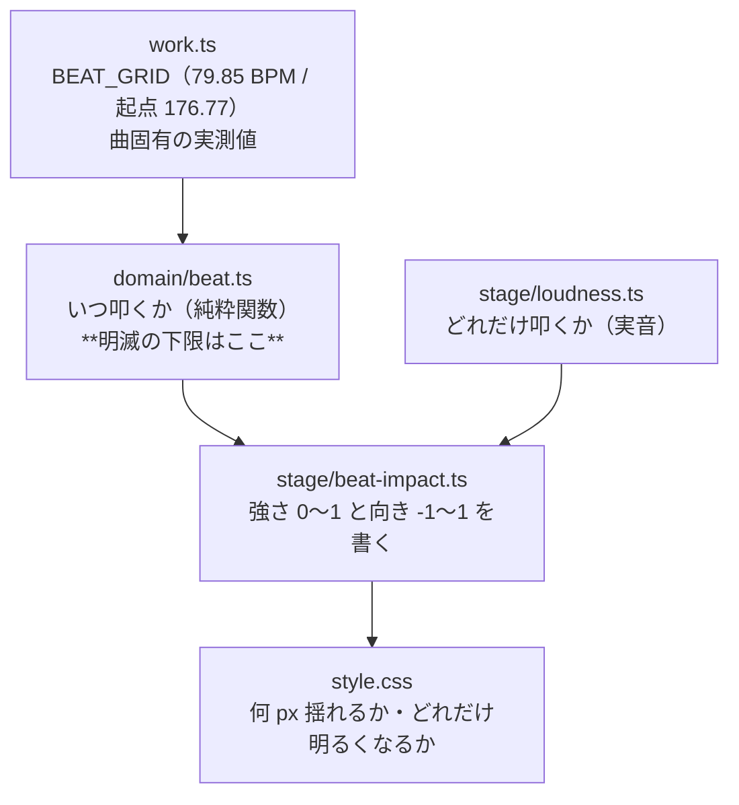

# M8-4: ビート同期の衝撃（Issue #49）

M8「文字PV 化」の最後の一片。構図（M8-1）・刻み（M8-5）・書体（M8-2a）・配色（M8-2）・
図形（M8-3）まで揃った画に、**音に叩かれること**を足した。拍の頭で画面がわずかに瞬き、
8 分ごとに画面が揺れる。

## 何ができるようになったか

コードから見ると、毎フレーム再生位置を渡すだけ。

```ts
const beatGrid = shiftBeatGrid(BEAT_GRID, workWindow.start);
const beatImpact = mountBeatImpact(
  { layer: screenDecor, lines },
  {
    flash: createFlashPulse(beatGrid, { division: 1, decay: 0.5 }),
    shake: createBeatPulse(beatGrid, { division: 2, decay: 0.45 }),
  },
  prefersReducedMotion,
  loudness.level,
);

ticker.subscribe(() => beatImpact.render(player.currentTime));
```

| | 刻み | 叩く先 | 振れ幅 |
|---|---|---|---|
| フラッシュ | 拍ごと（1.33Hz） | `mountScreenDecor` のレイヤーに敷いた光の膜 | 不透明度 最大 0.06 |
| 画面揺れ | 8 分ごと（2.66Hz） | `.stage__lines` | `clamp(3px, 1vmin, 10px)` |

どちらも**振れ幅は実音（M5-2 の解析）が決める**。静かな小節は控えめ、ラスサビは強い。

## 作りの地図



「進み具合だけを JS が書き、その意味は CSS が決める」は M8-3a（`--decor-grow`）・
M8-3c（`--sub-reveal`）と同じ分担。おかげで揺れ幅を `1vmin` と画面に追従させられる。

## 一番重かった判断: 明滅の安全

光過敏性発作の誘因を避けるため、**速さと明るさの両方**で守っている。

- **速さ** — `createFlashPulse` は `MIN_FLASH_INTERVAL`（0.4 秒 ＝ 2.5Hz）を下回る刻みを
  返さない。下回る指定は**間隔を倍にして粗い刻みへ落とす**（下限へ丸めると拍の格子から
  滑って曲とずれる）。BPM を上げても分割を細かくしても越えられない
- **明るさ** — 実測で地は `#0a0a0c` → 拍の頭で `#171719`。相対輝度は 0.31% → 0.96% で、
  WCAG 2.3.1 の general flash threshold（相対輝度 10% 以上の変化）に**そもそも届かない**

**下限が掛かるのは光る側だけ。** 揺れ（8 分）は明滅ではないので発作の閾値の話に乗らず、
前庭系への配慮は `prefers-reduced-motion` が受け持つ（振れ幅ごと 0 に畳む。ただし
光の膜も揺れる箱も**消さない** — #41 で粒と光を消さずに時刻を 0 に畳んだのと同じ判断）。

分けたぶん「8 分の刻みをうっかりフラッシュへ配線する」事故が起こりうるので、
**光る側は `FlashPulse` という別の型しか受け取らない**（`createFlashPulse` でしか作れない）。
値ではなく型で守る形にした。

印には `unique symbol` を使う。**素の真偽値（`safeToFlash: true`）では印にならない**
（レビュー指摘 🔴）— TypeScript は構造的部分型なので、その形を手で書き写した
`{ interval: 0.05 }`（20Hz）が `FlashPulse` として無警告で通ってしまう。安全の柱が
「型で守る」である以上、**doc に「作れない」と書いて実際は作れる状態が一番危ない**
（後任は型が止めてくれると信じて素通しする）。型が実際に止めることは
`@ts-expect-error` で検査している。

## 実測で分かったこと

Issue #49 に「揺らして遠近の基準が動かないか実測すること」と書いた懸念は**無かった**。

`perspective` は要素**自身の箱**を基準にするので、箱ごと動かしても子との位置関係は
変わらない。`z: -400px` の語句を置いて測ると、揺れの有無で幅 352.52 / 高さ 74 が
完全に一致し、動くのは平行移動ぶん（`translate3d`）だけだった。

測り方は Windows 側の Chrome（`--dump-dom` で `getBoundingClientRect` と
`getComputedStyle`、`--screenshot` の PNG から地の画素を直接読む）。**headless では
rAF が回らない**ので、時刻を渡して `render` を手で呼ぶ一時ページを立てて測った。

## 検査

- 拍の格子（`domain/beat.test.ts`）— 位相・間隔・負の時刻・**どんな BPM と分割を
  渡しても光る間隔が下限を下回らない**（仕組みで守れているか）
- 書き込む値（`beat-impact.test.ts`）— 何を書くかの計算は純粋関数（`impactValues`）に
  切り出してある。DOM を書く関数の中に置いたままだと、**`prefers-reduced-motion` の
  畳み込みを外しても量子化を外しても全テストが緑**だった（レビュー指摘 🔴）。
  実装を壊して 4 つとも赤くなることを確かめてある
- 明滅の明度差（`beat-impact.test.ts`）— 速さの安全は domain が守るが、**明るさの側は
  CSS にしかない**。`0.06` を `0.6` と打ち間違えても画は「派手になった」ようにしか見えない
- 揺らす先（`beat-impact.test.ts`）— 揺れの変数が `.stage__frame` の規則に書かれていない
  こと。あそこの transform は GSAP のもので、取り合いになると residue が戻る
- 配線（`wiring.test.ts`）— `mountBeatImpact` を本編とプレビューの両方が呼び、
  本編は `player.currentTime` を渡していること（実時間で回すとシークで拍だけ置いていかれる）
- 区間の頭が拍の上に載っている（`work.test.ts`）— Issue #37 で尺を広げるときの番人

## 残っているもの

- **M8 の残りは「尺を戻す」**（Issue #37）。`WORK_WINDOW` を `203.82` へ広げて残り 4 行を刻む
- `Starfield` は誰にも使われないまま（M8-2 の宿題）。M8 が終わる時点で消すかどうかを決める
