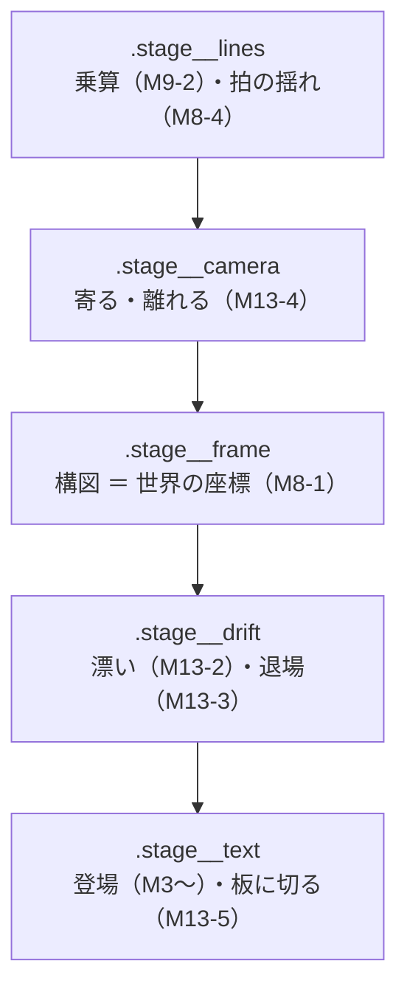

# M13 カメラで 1 語句ずつ映す（のっぺりの解消）

2026-08-28〜29。[Issue #73](https://github.com/bubbleShaker/lyric-stage/issues/73)。

作者の指摘から始まった:

> 文字が動いて登場した後にその場にい続けるのがあんまり良くない。歌詞一つ一つが単体で大きく出てきて、ふんだんに動きながら変わりゆくものが望ましい。3D っぽく遠近感のある表現を織り交ぜて欲しい。漢字を分解してそれを要素にして組み合わせたり離れたりなどの演習もあるとのっぺり感がなくて望ましい

> （追加で）カメラモーションを使ったように近寄ったり離れたりして、**対応するセリフだけ画面に映るようにして欲しい。魔法と言ってる時は魔法だけ映す、それ以外は映さない**

## のっぺりの正体

演出（`stage/effects.ts`）はどれも**登場を 1 本返すだけ**で、素の見えへ着地したらそこで終わる。行の間隔は 3 秒あり語句は積み上がる（M8-5）ので、**止まった語句が 2〜3 個並ぶ時間**が生まれていた。3D も登場の一瞬だけで、着地後は平面に戻っていた。

## 何をしたか

| 歩 | 中身 | PR |
|---|---|---|
| M13-1 | 行の表示長さを presenter へ渡す（すべての前提） | [#76](https://github.com/bubbleShaker/lyric-stage/pull/76) |
| M13-2 | 漂い — 着地した語句が滞在のあいだ動き続ける | [#76](https://github.com/bubbleShaker/lyric-stage/pull/76) |
| M13-3 | 退場 — 語句が次へ渡すときに奥へ引く（**M8-5 の積み上げの取り消し**） | [#78](https://github.com/bubbleShaker/lyric-stage/pull/78) |
| M13-4 | カメラで 1 語句ずつ映す（構図を世界の座標へ読み替え） | [#80](https://github.com/bubbleShaker/lyric-stage/pull/80) |
| M13-5 | 板に切る分解 | [#82](https://github.com/bubbleShaker/lyric-stage/pull/82) |

**歌詞シートはほぼ書き換えていない**（`slice` を 2 語句に当てた 2 行だけ）。構図（`place`）の意味が「画面のどこに置くか」から「どこへカメラを向けるか」へ読み替わっただけなので、51 行の値はそのまま生きている。

## 決め方 — 見た目は動くページで選んでもらった

**静止画では「のっぺりかどうか」を判断できない。** 作品と同じ書体（部首の字を足したサブセット）・地の色・遠近・乗算で組んだ候補ページを作り、軸ごとに選んでもらった。

- 軸 A（滞在と退場）… 今のまま / 漂い / 漂い＋退場 → **漂い＋退場**
- 軸 B（漢字の分解）… 板に切る / 部首で割る / 両取り → **板に切る**

**部首で割る案が落ちた理由が実装の外にあった**: 作品の書体（Zen Kaku Gothic New Black）は**部首単体の字形を持っていない**（`氵` `艹` `罒` `刂` `亻` `灬`）。「法」のような字だけ割れず、画が不揃いになる。板に切る方は字形を見ないので、かなでも英字でも同じように効く。

## 引っかかった所（画を見なければ気付けなかったもの）

| 症状 | 原因 |
|---|---|
| 2 つ目の語句が画面の隅へ飛ぶ | 1 つ目に寄せてから 2 つ目を測っていた（測定値に寄せた分が掛かる）。**測り方を `getBoundingClientRect` から `offsetLeft` へ**変えて、順序の約束に頼らない形にした |
| 端に置いた語句が枠から外れる（画面の 0.59 に着く） | 倍率だけを打ち消していて、カメラの回転のぶんが残っていた |
| **何も見えない 0.25 秒**ができる | カメラが着いた時、前の語句は枠の外・次の語句はまだ不透明度 0。着地を語句より後ろへずらした |
| 最後の語句が出切る前に引き始める | 行の終わりから逆算した退場が、登場の途中に来ていた（本編の `ネーション` は差が 0.001 秒） |

## 引っかかった所（検査でしか気付けなかったもの）

| 症状 | 原因 |
|---|---|
| `filter: blur(0px)` が語句の出ている**全区間**に効く | gsap の `fromTo` は既定で始点を組み立て時に書く。`none` 以外の `filter` は要素を平面に潰すので、`preserve-3d` が無効になり `rushIn` の奥行きがただの平行移動になっていた（Chromium で `matrix3d` が消えることを実測） |
| 板の字が 1 枚ごとに倍に増える | 板は字の中へ入れるので `char.textContent` が伸びる。画に出ていなかったのは `clip-path` が行の高さの外を塗らないからで、**偶然** |
| 縦組みの語句が画面から溢れうる | 寄る量を幅だけで決めていた（実測で 13 字の縦組みが画面の 1.97 倍） |

## 検査について学んだこと

reviewer に**「見ているつもりで見ていない」検査を 8 件**指摘された。共通する形は 3 つ:

1. **同語反復** — `framingFor` の答えを `framingFor` で確かめる、`MIN_STAY` から境界を組み立てる、`SLICE_COUNT` を `SLICE_COUNT` と比べる
2. **片側しか見ない** — `rotate(Z)` の混ぜる項は x か y の片方だけ動かすと 0 になる。散らした 5 項目のうち 1 つしか見ていない
3. **`??` の既定値** — `Number(x ?? 0)` は「x が消えたときに緑にする」働きしかない

答えとして採ったのは **逆向きに独立に組み立てること**（`camera.test.ts` の `landingOf` は CSS の合成を検査の側でなぞる）と、**わざと壊して確かめること**。M13 の後半は、直すたびに 3〜4 通りのミューテーションで実際に赤くなることを確認してからマージした。

## 残した宿題

- **多くの語句が寄る量の上限に張り付く**（1920px 幅で 27 語句中 24 個）。根本は文字の基準寸法が `clamp(1.75rem, 7vw, 5rem)` で頭打ちになること。広い画面ほど語句は相対的に小さく、目安（画面の 62%）に届かせるには 10 倍近い拡大が要る → **M7（レスポンシブ）**
- 漂いの見かけの倍率が画面幅で 1.07〜1.62 倍まで振れる（遠近が `70vw` に追従するため）→ **M7**
- 拍の揺れ（M8-4）はカメラの外にあるので、字に対する相対的な揺れがカメラの倍率ぶん小さくなっている
- `LyricStage` の DOM 配線に単体テストが無い（jsdom 未導入 / [#29](https://github.com/bubbleShaker/lyric-stage/issues/29)）。今は `wiring.test.ts` が原文を走査して代わりをしている
